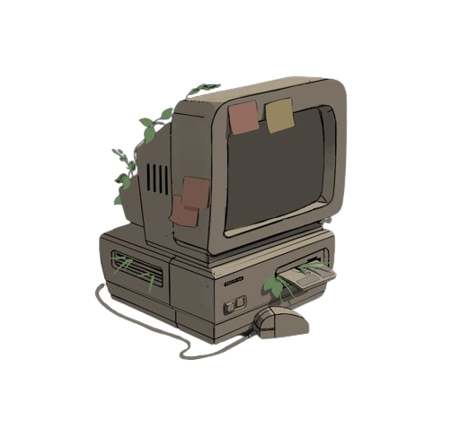

<body style="background-color: #151514">

  <h1 align="left">|🪴🎧☕</h1>
  <h4>⁕ Brasileiro, cursando Sistemas de Informação pelo <a style="color:#086637" target="blank" href="https://www.ifsudestemg.edu.br/manhuacu">IFSEMG - Campus Manhuaçu.</a></h4>
  <h4>⁕ Atualmente estudando Desenvolvimento Web Fullstack, e Desenvolvimento Desktop</h4>

  

    
    
    
  

  <h3 style="color:#086637">Projetos</h3>

 

<h3 style="color:#086637">Skills</h3>

  
  
   
        
   
  

 

  
  
  
   
                

 
 
 

<h3 style="color:#086637">Contato:</h3>

  
  
  

</body>